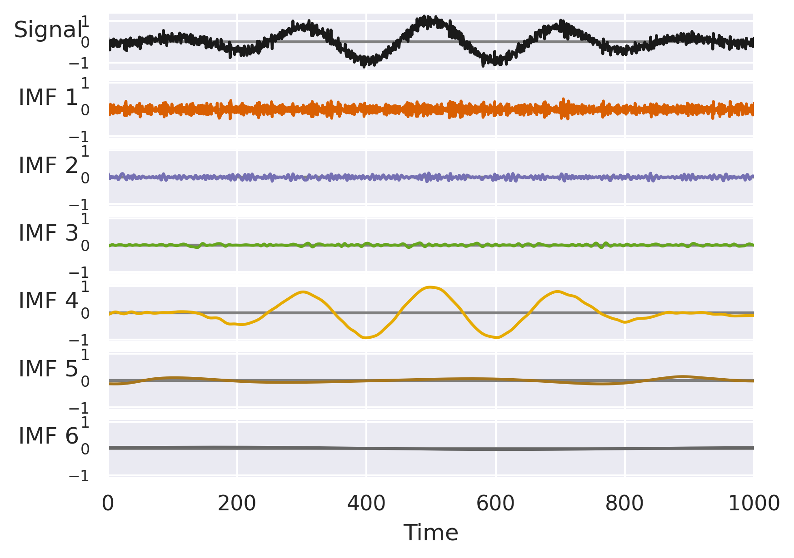
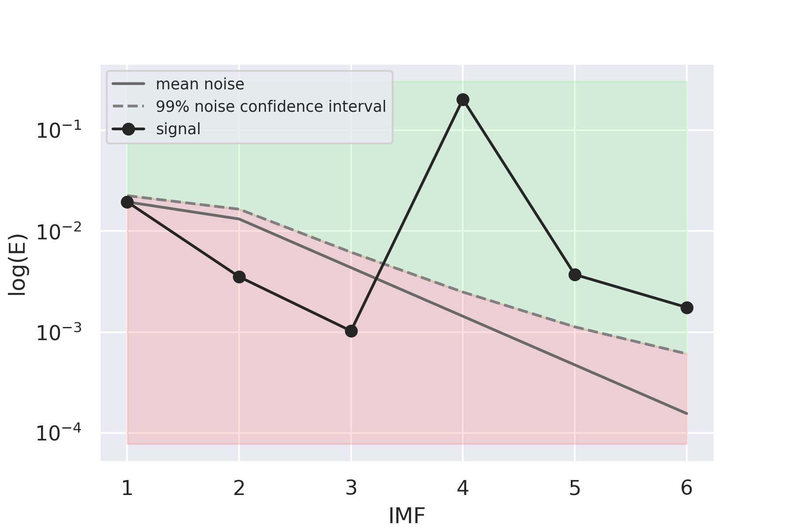
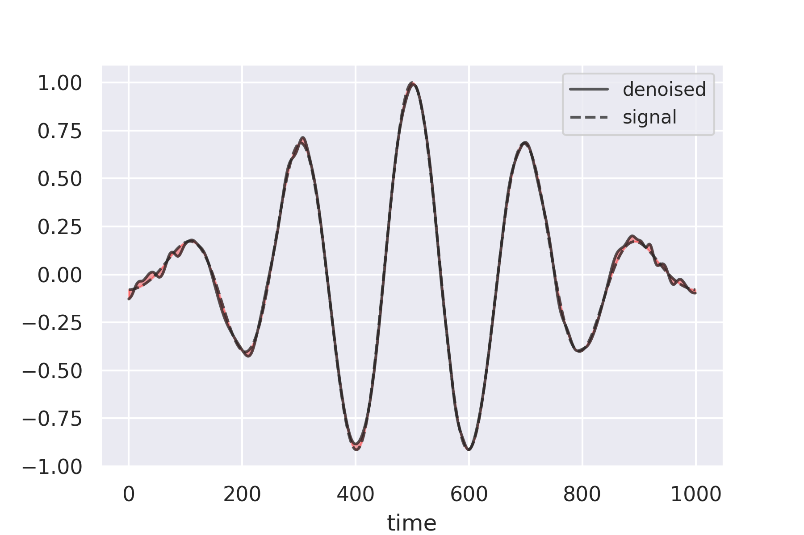

Detrending and Denoising with Empirical Mode Decompositions
---
Given work is a study of a [Detrending and Denoising with Empirical Mode Decompositions](http://perso.ens-lyon.fr/patrick.flandrin/EUSIPCO04_PFPGGR.pdf) paper and its application to custom data.

**Project report PDF file** can be found [here](docs/EMD_Denoising_report.pdf).  
The Google Colab notebook used is available [here](https://colab.research.google.com/drive/1Nsv7k2cvYNKL_9_ZjdrhQw2IE3Nmo8tb?usp=sharing) or as an `.ipynb` in the repo itself.  

## Abstract
This work is dedicated to the analysis of the paper "Detrending and denoising with empirical mode decompositions" by [Flandrin et al., 2004a]. The report compiles several relevant papers on the topic and presents a deconvoluted explanation of important aspects. The algorithm is tested against data of a variable fit, and the results show that it produces relatively good denoising/detrending even on non-standard data. The method for slight Hurst exponent estimation improvement is also proposed and tested yielding marginal gain in estimation quality.

## Visualization
IMFs for the synthetic signal |
:-------------------------:|
 |

Signal IMF’s energies | Denoised and pure signal
:-------------------------:|:-------------------------:
 |   